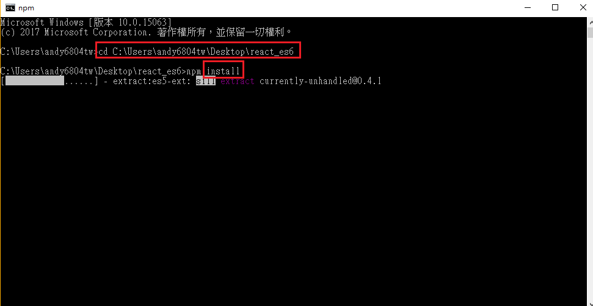
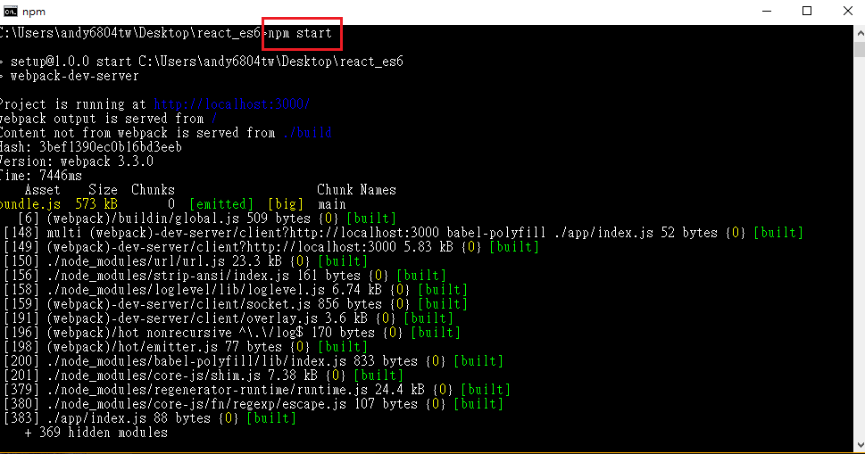

# Building with react

## How to use

1. clone專案後，開啟cmd路徑移置該專案目錄，下載node_module</br>
```
npm install
``` 


2. 之後打開瀏覽器輸入localhost:3000就可以同步開發囉，當您修改程式碼會立即在網頁上做更改不必另外鍵入npm run build</br>
```
npm start
```



## module
```java
"devDependencies": {
    "babel-core": "^6.25.0",
    "babel-loader": "^7.1.1",
    "babel-polyfill": "^6.23.0",
    "babel-preset-es2015": "^6.24.1",
    "babel-preset-react": "^6.24.1",
    "react": "^15.6.1",
    "react-dom": "^15.6.1",
    "webpack": "^3.3.0",
    "webpack-dev-server": "^2.6.1"
  }
```
